# Relatório de Laboratório

*Laboratório de Experimentação de Software — Modelo/Template de Relatório*

Este documento é um MODELO válido para qualquer um dos 5 laboratórios da disciplina (Lab01 a Lab05). Os parágrafos em itálico cinza/verde, iniciados por "ORIENTAÇÃO", explicam o que cada subseção deve conter — apague-os e escreva o conteúdo real do grupo no lugar. Textos entre colchetes [assim] indicam onde inserir informação específica do seu grupo/laboratório.

| | |
|---|---|
| **Curso** | Engenharia de Software |
| **Disciplina** | Laboratório de Experimentação de Software |
| **Turno / Período** | Noite / 6º |
| **Professor(a)** | Danilo Maia |
| **Laboratório** | [Lab02 — Assistentes de IA vs. Codificação Manual] |
| **Grupo (trio)** | Arthur Lara Panzera · Felipe Augusto Pereira · Gabriel Reis Lebron |
| **Link do repositório / GitHub Projects** | https://github.com/Lab-Experimentao/Lab02-AssistentesDeIA |
| **Data de entrega** | 23/09/2026 |

---

## 1. Introdução

Ferramentas de IA generativa (GitHub Copilot, ChatGPT, Claude, Gemini etc.) se tornaram onipresentes no desenvolvimento de software, mas grande parte do que se afirma sobre seu impacto em produtividade e qualidade vem de relato anedótico, sem controle experimental. Este laboratório busca produzir evidência controlada e reproduzível sobre o efeito real de um assistente de IA na resolução de tarefas de programação, comparando-o diretamente com a codificação manual sob as mesmas condições.

O grupo conduziu um experimento controlado do tipo *crossover within-subject*: cada um dos 3 integrantes resolveu 6 katas autorais em Java, 3 deles com apoio de um assistente de IA (tratamento `com_ia`) e 3 sem nenhum apoio (tratamento `sem_ia`), em ordem contrabalanceada e sob o mesmo time-box de 35 minutos por trial, totalizando **18 trials**.

As Questões de Pesquisa do enunciado, mantidas sem alteração, são:

- **RQ1**: o uso de assistente de IA reduz o tempo necessário para resolver uma tarefa de programação?
- **RQ2**: o uso de assistente de IA reduz a quantidade de defeitos (testes que falham) no código produzido?
- **RQ3**: o uso de assistente de IA altera a complexidade ciclomática ou a duplicação do código produzido?

Hipóteses informais do grupo, definidas antes da execução (S02) e formalizadas em H0/H1 no desenho do experimento ([HIPOTESES.md](HIPOTESES.md)):

- **RQ1**: esperava-se que o uso de IA reduzisse o tempo até passar em todos os testes de aceitação (*time-to-green*), pela geração e revisão de código mais rápida que a digitação manual.
- **RQ2**: esperava-se que a taxa de sucesso dos testes ao final do time-box fosse igual ou maior com IA, já que o assistente ajudaria a produzir código correto mais depressa, sobrando mais tempo para revisão dentro do próprio trial.
- **RQ3**: esperava-se pouca diferença de complexidade ciclomática ou duplicação entre os tratamentos, mas um possível aumento de verbosidade (LOC) no código gerado por IA, por isso o LOC entrou como métrica de controle obrigatória, e não apenas complementar.

Além do descrito no enunciado, o grupo propôs seis frentes adicionais de análise:

1. Conformidade com style guide (PMD `codestyle`) do código de cada trial, normalizada por 100 LOC, comparando `com_ia` e `sem_ia`.
2. Correlação entre o tempo do trial e o número de violações de estilo, dentro de cada tratamento, para testar se a pressa e não a IA em si, explica parte da diferença de conformidade observada.
3. Varredura de vulnerabilidades estáticas (Semgrep) sobre o código final de cada trial.
4. Tamanho de efeito (r rank-biserial e Cliff's delta), complementando o p-valor de RQ1 e RQ3 dado o N pequeno (18 trials).
5. Identificação e tratamento sistemático de outliers no dataset consolidado, via cercas de Tukey.
6. Dashboard de visualização consolidando tempo, taxa de sucesso e métricas estáticas entre os tratamentos.

## 2. Contexto

Este é o Lab02 da disciplina, um experimento autocontido: diferente de laboratórios que reaproveitam dados de etapas anteriores, aqui tanto o desenho experimental (S01) quanto a coleta de dados (S02) e a análise (S03) foram produzidos inteiramente dentro deste laboratório, ao longo de três sprints mais o Relatório Final.

O objeto de estudo é o próprio processo de resolução de problemas de programação: 6 katas autorais em Java ([katas/README.md](katas/README.md)), quatro de dificuldade base (Cofre de Senhas, Elevador do Prédio, Etiquetas de Preço, Fila do Caixa) e dois de dificuldade intencionalmente maior (Estoque do Depósito, Blocos Aninhados), resolvidos por cada um dos 3 integrantes do grupo (Arthur, Felipe, Gabriel), metade das vezes com um assistente de IA generativa habilitado e metade sem, sob um time-box fixo de 35 minutos por trial. Os katas são autorais e de baixa indexação de propósito, para reduzir o risco de o assistente reproduzir uma solução já vista em treinamento em vez de efetivamente ajudar (ver ameaças à validade em [HIPOTESES.md](HIPOTESES.md)).

O desenho segue o método GQM (*Goal-Question-Metric*) de Basili, Caldiera e Rombach: o Goal, as três Questions (RQ1-RQ3) e as métricas candidatas do enunciado estão detalhados em [DESENHO_EXPERIMENTO.md](DESENHO_EXPERIMENTO.md). A métrica estrutural da RQ3 (complexidade ciclomática) segue a definição clássica de McCabe (1976), coletada via CK; a duplicação de código, via PMD CPD. Dado o N pequeno (18 trials, 9 por tratamento), a análise estatística segue a recomendação do próprio enunciado de usar estatísticas não paramétricas, mediana e IQR nas tabelas descritivas, teste de Wilcoxon signed-rank (pareado) e Mann-Whitney U (não pareado) na análise inferencial, consistente com a prática usual em estudos de engenharia de software com amostras reduzidas.

## 3. Metodologia

Esta seção descreve como o grupo executou, na prática, o desenho apresentado na seção 2: as dificuldades reais enfrentadas (3.1), as decisões metodológicas e seus trade-offs (3.2), a divisão do trabalho por sprint refletindo o board do GitHub Projects (3.3), as ferramentas usadas (3.4), a tabela RQ→métrica→definição operacional (3.5) e as seis frentes de inovação do grupo (3.6).

### 3.1 Principais Desafios

**Padronizar katas de dificuldade equivalente sem risco de memorização pela IA.** Katas clássicos (LeetCode/HackerRank) correm o risco de já terem sido vistos no treinamento do Claude, o que inflaria artificialmente o ganho `com_ia` sem refletir ajuda real. O grupo optou por escrever 6 katas autorais e de baixa indexação, calibrados manualmente para ficar perto do teto do time-box de 35 min, com dois deles (Estoque do Depósito, Blocos Aninhados) deliberadamente mais difíceis detalhado em [katas/README.md](katas/README.md).

**Reprodutibilidade do ambiente de coleta entre as três máquinas do grupo.** JDK, CK, PMD, JUnit Console e Semgrep precisavam se comportar de forma idêntica nas máquinas de todos os integrantes para que os tempos e métricas estáticas fossem comparáveis. A solução foi empacotar toda a cadeia de ferramentas numa única imagem Docker ([docker/Dockerfile](docker/Dockerfile)), com versões fixadas (ex. Semgrep `1.90.0`, CK `0.7.0`, PMD `7.7.0`).

**Falha de ambiente durante a coleta real.** No trial `trial-felipe-01-elevador-do-predio-sem_ia`, o processo Java do JUnit travou a 100% de CPU por cerca de 13 minutos dentro do container, sem progresso. O trial foi abortado e reiniciado do zero antes de qualquer linha ser gravada, então o dado commitado já é da segunda tentativa, sem contaminação de tempo.

**Confiar num resultado "zero" sem evidência de que o instrumento funciona.** A varredura de vulnerabilidades (Semgrep, RQ de inovação) devolveu 0 achados nos 18 trials, um resultado indistinguível, à primeira vista, de uma falha silenciosa do scanner (ex. path errado, ruleset não carregado). Antes de aceitar o zero como resultado real, o grupo validou a ferramenta contra um arquivo Java sintético com vulnerabilidades propositais (SQL montado por concatenação, uso de MD5, senha hardcoded, deserialização insegura); o Semgrep detectou corretamente os problemas plantados que o ruleset `p/java` cobre, confirmando que o zero nos trials reais reflete o código (métodos estáticos simples, sem I/O/SQL/criptografia), não uma falha do instrumento.

### 3.2 Tomadas de Decisão

**Limite de WIP da coluna Doing: 3 (uma Issue por integrante do trio).** Justificativa: com um limite igual ao número de integrantes, cada pessoa mantém no máximo uma tarefa em andamento por vez, o que facilita controlar o fluxo de Issues sendo movidas de Doing para Review, evitando que várias tarefas fiquem abertas em paralelo pela mesma pessoa sem terminar nenhuma, e torna imediato perceber quando alguém está com a coluna "cheia" e precisa finalizar ou revisar antes de puxar a próxima.

**Assistente de IA único e fixo: Claude (versão gratuita, claude.ai).** Para que o tratamento `com_ia` fosse comparável entre os três integrantes e os 9 trials com IA, o grupo fixou uma única ferramenta para todo o experimento em vez de deixar cada integrante usar o assistente de sua preferência, o que misturaria "efeito da IA" com "efeito de qual IA".

**Linguagem Java, não Python/Radon.** A ferramenta de complexidade ciclomática exigida para RQ3 (CK) só analisa bytecode/fonte Java. Fixar Java evita trocar de ferramenta de métrica estática (Radon, para Python) entre integrantes ou katas, o que quebraria a comparabilidade das métricas de RQ3 dentro do experimento.

**Desenho crossover within-subject com dupla contrabalanceação.** Com apenas 3 integrantes, um desenho between-subject (cada pessoa só num tratamento) deixaria a variação individual de habilidade dominar o resultado. Por isso cada integrante passa pelos dois tratamentos (3 katas `com_ia`, 3 `sem_ia`), com dois cuidados adicionais: a ordem dos katas é contrabalanceada por integrante (rotação cíclica), e o tratamento alterna a cada trial, nunca dois seguidos iguais, para não confundir fadiga/aprendizado de sessão com o efeito da IA (matriz completa em [CONTRABALANCEAMENTO.md](CONTRABALANCEAMENTO.md)).

**Outlier estatístico não é excluído por padrão.** Ao revisar o dataset consolidado (cercas de Tukey), dois trials do kata Cofre de Senhas apareceram como outliers de LOC. O grupo decidiu mantê-los sem exclusão: a causa identificada foi o próprio kata (único com dois métodos, portanto inerentemente maior), não dado corrompido ou falha de ambiente. A política adotada foi excluir um outlier só havendo evidência concreta de corrupção por falha de infraestrutura, o que não é o caso aqui.

**Estatística não paramétrica, com tamanho de efeito como complemento do p-valor.** Dado o N pequeno (18 trials, 9 por tratamento), o grupo seguiu mediana/IQR nas tabelas descritivas e Wilcoxon signed-rank (pareado) / Mann-Whitney U (não pareado) na análise inferencial, como recomendado no enunciado. Como contribuição adicional (seção 3.6), complementou RQ1 e RQ3 com tamanho de efeito (r rank-biserial e Cliff's delta), porque um p-valor "não significativo" com N=18 pode só indicar "não deu para detectar", não "não há efeito".

### 3.3 Etapas

O laboratório foi dividido em três sprints (milestones `LAB02S01`, `LAB02S02`, `LAB02S03` no GitHub Projects) mais o Relatório Final. A tabela abaixo reflete os Assignees reais de cada issue no board.

| Sprint | Entregas | Responsável | Issue (nº) |
|---|---|---|---|
| S01 | Ambiente e script de coleta de métricas estáticas; escolha e fixação do assistente de IA único do experimento; consolidação do Desenho do Experimento (conjunta) | Arthur Lara Panzera | #2, #5, #6 |
| S01 | Escolha, validação e script de verificação dos katas; redação de hipóteses, variáveis e ameaças à validade; consolidação do Desenho do Experimento (conjunta) | Felipe Augusto Pereira | #3, #4, #5 |
| S01 | Script de cronometragem e coleta de tempo (time-to-green); definição da ordem contrabalanceada por integrante; consolidação do Desenho do Experimento (conjunta) | Gabriel Reis Lebron | #1, #5, #7 |
| S02 | Execução dos 6 trials (katas 1-6, alternando com/sem IA); consolidação dos dados brutos de todos os trials (conjunta) | Arthur Lara Panzera | #19, #21-#25, #32 |
| S02 | Execução dos 6 trials (katas 1-6, alternando com/sem IA); levantamento dos katas restantes; varredura de vulnerabilidades no código gerado (inovação); consolidação dos dados brutos de todos os trials (conjunta) | Felipe Augusto Pereira | #13-#18, #20, #32, #37 |
| S02 | Execução dos 6 trials (katas 1-6, alternando com/sem IA); conformidade com linter/style guide (inovação); consolidação dos dados brutos de todos os trials (conjunta) | Gabriel Reis Lebron | #26-#31, #32, #38 |
| S03 | Análise estatística de RQ1/RQ2 (tempo e defeitos) e RQ3 (estrutura do código); Relatório: resultados; Relatório Final (conjunta) | Arthur Lara Panzera | #47, #48, #50, #53 |
| S03 | Identificação e tratamento de outliers (inovação); dashboard de visualização (inovação); cálculo de tamanho de efeito — Cliff's delta / r de Wilcoxon (inovação); Relatório: metodologia; Relatório Final (conjunta) | Felipe Augusto Pereira | #46, #49, #50, #52, #57 |
| S03 | Relatório: introdução e contexto e conclusão; normalização de violações de estilo por LOC (inovação); correlação entre tempo do trial e violações de estilo (inovação); Relatório Final (conjunta) | Gabriel Reis Lebron | #50, #51, #54, #55, #56 |

**Distribuição de issues por integrante** (contando cada issue uma vez por Assignee):

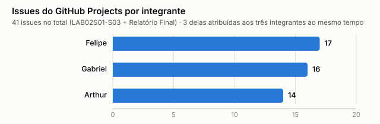

#### Configuração do processo

- **Colunas do board**: Backlog → To Do → Doing → Review → Done.
- **Limite de WIP (coluna Doing)**: 3 — uma issue por integrante do trio, controlando o fluxo de Doing para Review (justificativa completa em 3.2).
- **Print do board ao final do Lab02**: [inserir aqui a captura de tela do board]

### 3.4 Ferramentas

Toda a cadeia de coleta e análise, empacotada numa imagem Docker única ([docker/Dockerfile](docker/Dockerfile)) para reprodutibilidade entre as três máquinas do grupo, exceto onde indicado:

| Ferramenta | Versão | Função | RQ / Inovação |
|---|---|---|---|
| Docker | Docker Desktop (imagem própria `lab02-metrics`) | Empacota toda a cadeia de ferramentas (JDK, CK, PMD, JUnit, Semgrep) numa imagem única, para que a coleta seja reprodutível entre as três máquinas do grupo | Todas (infraestrutura) |
| Java (Eclipse Temurin JDK) | `17` | Linguagem dos katas e runtime de compilação/execução dos trials; fixada porque o CK (RQ3) só analisa bytecode/fonte Java | Todas |
| CK (`com.github.mauricioaniche:ck`) | `0.7.0` | Extrai complexidade ciclomática (WMC) por método e LOC do código Java final de cada trial | RQ3 |
| PMD CPD | `7.7.0` | Mede duplicação de código (% de linhas duplicadas) sobre o código final de cada trial | RQ3 |
| PMD `codestyle` | `7.7.0` | Conformidade com style guide, normalizada por 100 LOC (`scripts/lint_trials.py` + `scripts/normalizacao_estilo_loc.py`) | Inovação 1 |
| Semgrep, ruleset `p/java` | `1.90.0` | Varredura de vulnerabilidades estáticas sobre o código final de cada trial (`scripts/security_scan.py`) | Inovação 3 |
| JUnit Platform Console Standalone | `1.10.2` | Roda os testes de aceitação de cada kata; base da cronometragem do time-to-green e da contagem de testes passando/falhando | RQ1, RQ2 |
| Python 3 | 3.x | Orquestra a coleta (`scripts/time_trial.py`, `scripts/collect_metrics.py`) e implementa Wilcoxon, Mann-Whitney, Spearman, ranks e tamanho de efeito em [scripts/stats_utils.py](scripts/stats_utils.py) (`scripts/correlacao_tempo_violacoes.py`, `scripts/tamanho_efeito_rq1_rq3.py`, `scripts/outliers.py`) | RQ1-RQ3, inovações 2, 4, 5 |
| Apache ECharts (via CDN) | `6.1.0` | Gera o dashboard HTML autocontido (`scripts/build_dashboard.py`, boxplots + slope charts, `results/dashboard.html`), fora do Docker | Inovação 6 |
| GitHub Projects | v2 | Ferramenta de processo do grupo — board em https://github.com/Lab-Experimentao/Lab02-AssistentesDeIA | Processo |

### 3.5 Tabela de Métricas

| RQ | Métrica | Definição Operacional | Unidade | Ferramenta / Fonte |
|---|---|---|---|---|
| RQ1 | Time-to-green | Tempo decorrido do início do trial até todos os testes de aceitação passarem; trial sem sucesso é censurado em exatamente 35 min (time-box), não descartado | Minutos (seg. no CSV) | `scripts/time_trial.py` → `results/time_results.csv` |
| RQ2 | Taxa de sucesso dos testes | (nº de testes de aceitação passando ÷ nº total de testes do kata) × 100, ao final do time-box | % | `scripts/time_trial.py` → `results/time_results.csv` |
| RQ2 (complementar) | Nº de testes falhando | Contagem absoluta de testes de aceitação não passando ao final do time-box | Testes | `scripts/time_trial.py` → `results/time_results.csv` |
| RQ3 | Complexidade ciclomática média | Média do WMC (McCabe, 1976) entre todos os métodos do arquivo `.java` final do trial | Nº médio por método | CK `0.7.0` → `scripts/collect_metrics.py` → `results/metrics_results.csv` |
| RQ3 | Duplicação de código | % de linhas duplicadas detectadas pelo PMD CPD sobre o código final do trial | % | PMD CPD `7.7.0` → `scripts/collect_metrics.py` → `results/metrics_results.csv` |
| RQ3 (controle) | LOC | Linhas de código (excl. em branco/comentário) do arquivo final do trial | Linhas | CK `0.7.0` → `scripts/collect_metrics.py` → `results/metrics_results.csv` |
| Inovação 1 | Violações de estilo por 100 LOC | Nº de violações PMD `codestyle` ÷ (LOC ÷ 100) | Violações/100 LOC | PMD `codestyle` → `scripts/lint_trials.py` + `scripts/normalizacao_estilo_loc.py` → `results/lint_normalizado_comparacao.csv` |
| Inovação 2 | Correlação tempo × violações | Coeficiente de Spearman (exato) entre tempo do trial e violações de estilo, calculado separadamente dentro de `com_ia` e `sem_ia` | rho [-1, 1] | `scripts/correlacao_tempo_violacoes.py` → `results/correlacao_tempo_violacoes.csv` |
| Inovação 3 | Achados de segurança estática | Nº de achados do Semgrep (ruleset `p/java`) sobre o código final do trial, por severidade (ERROR/WARNING/INFO) | Achados | Semgrep `1.90.0` → `scripts/security_scan.py` → `results/security_results.csv` |
| Inovação 4 | Tamanho de efeito (RQ1 e RQ3) | r rank-biserial (a partir do `W+` do Wilcoxon pareado por kata) e Cliff's delta (a partir do `U` do Mann-Whitney não pareado), com magnitude classificada pelos limiares de Romano et al. (2006)/Vargha & Delaney (2000) | Escala [-1, 1] | `scripts/tamanho_efeito_rq1_rq3.py` → `results/tamanho_efeito_rq1_rq3.csv` |
| Inovação 5 | Distância às cercas de Tukey | Distância de cada observação (`tempo_seg`, `loc_total`, `cc_media`, `duplicacao_pct`, `violacoes_por_100loc`) aos limites Q1−1,5×IQR/Q3+1,5×IQR (moderado) e Q1−3×IQR/Q3+3×IQR (extremo) do dataset consolidado | Múltiplos de IQR | `scripts/outliers.py` → `results/outliers.csv` |

### 3.6 Inovações Propostas pelo Grupo (30% da nota)

Além dos 70% do enunciado (RQ1-RQ3), o grupo propôs seis frentes adicionais, todas com métrica, ferramenta e H0/H1 (quando aplicável) documentadas em [HIPOTESES.md](HIPOTESES.md) e na tabela 3.5, e com resultado a ser discutido nas seções 4.2/4.3 e retomado na Conclusão:

1. **Conformidade com style guide (PMD `codestyle`), normalizada por 100 LOC.** Motivação: RQ3 do enunciado cobre complexidade e duplicação, mas não estilo, uma dimensão de qualidade que a IA pode afetar de forma diferente (ex. gerar código mais verboso, mas nem por isso mais idiomático). Normalizar por LOC evita que katas maiores pareçam sistematicamente "menos conformes" só por terem mais código.
2. **Correlação entre tempo do trial e violações de estilo, por tratamento.** Motivação: testar uma explicação alternativa para uma eventual diferença de conformidade, se o fator é a pressa do time-box, e não a IA em si, a correlação deveria aparecer nos dois tratamentos igualmente; se for específica de `com_ia`, sugere um trade-off velocidade/qualidade próprio do uso de IA.
3. **Varredura de vulnerabilidades estáticas (Semgrep) sobre o código final de cada trial.** Motivação: nenhuma das RQ1-RQ3 do enunciado observa segurança; com assistentes de IA cada vez mais usados em código de produção, é uma dimensão de qualidade relevante de comparar entre `com_ia` e `sem_ia`, mesmo que os katas não tenham superfície de ataque rica.
4. **Tamanho de efeito (r rank-biserial e Cliff's delta) para RQ1 e RQ3.** Motivação: com N=18, um p-valor "não significativo" pode só indicar poder estatístico insuficiente, não ausência de efeito; o tamanho de efeito complementa o p-valor com a magnitude e a direção da diferença observada nesta amostra.
5. **Identificação e tratamento sistemático de outliers, via cercas de Tukey.** Motivação: o enunciado alerta para o risco de um dado discrepante (ex. censura por bug de ambiente) distorcer mediana/IQR; o grupo formalizou essa checagem em vez de tratá-la caso a caso, cobrindo as cinco métricas numéricas do dataset consolidado.
6. **Dashboard de visualização (Apache ECharts) consolidando tempo, taxa de sucesso e métricas estáticas.** Motivação: facilitar a leitura comparativa `com_ia` vs. `sem_ia` de todas as RQs (enunciado + inovações) num único artefato navegável, em vez de gráficos estáticos isolados por questão.

## 4. Resultados

### 4.1 Coleta de Dados

Os 18 trials planejados (3 integrantes x 6 katas, 9 `com_ia` e 9 `sem_ia`) foram todos concluídos, 100% do volume-alvo, entre 14 e 16 de setembro de 2026. Nenhum trial foi descartado, censurado (não terminou dentro do time-box de 35 minutos) ou abortado por falha de ambiente, os 18 têm status `sucesso` em `results/time_results.csv`, com 100% dos testes de aceitação passando ao final de cada um.

A revisão sistemática de outliers ([scripts/outliers.sh](scripts/outliers.sh), cercas de Tukey 1,5x/3x IQR sobre tempo, LOC, complexidade, duplicação e violações de estilo) identificou dois trials fora da cerca de LOC, nenhum nas demais métricas. `trial-arthur-01-cofre-de-senhas-sem_ia`, 118 LOC, outlier extremo, acima da cerca superior de 66,75 (mediana do grupo na faixa de 30-40 LOC), e `trial-gabriel-05-cofre-de-senhas-com_ia`, 79 LOC, outlier moderado, mesma cerca. Os dois foram revisados e mantidos no dataset, ambos do kata Cofre de Senhas, o mais longo dos seis, não indício de erro de coleta, e a decisão está detalhada em [HIPOTESES.md](HIPOTESES.md#identificação-e-tratamento-de-outliers).

Duplicação de código (PMD CPD) deu 0% nos 18 trials, sem nenhuma ocorrência em nenhum tratamento, resultado plausível para katas desse tamanho e já validado com um teste sintético de duplicação antes da coleta real.

### 4.2 Visualização Gráfica

Cada RQ recebe um boxplot pareado (`com_ia` vs `sem_ia`) e, quando aplicável, um gráfico de pontos conectados por kata, o tipo de visualização recomendado para comparar dois tratamentos no mesmo grupo. Os dois tipos se repetem ao longo da seção, a leitura abaixo vale para todos. No boxplot, a caixa cobre do primeiro ao terceiro quartil, os 50% centrais dos 9 trials daquele tratamento, com a mediana marcada dentro dela, os traços finos (whiskers) marcam o menor e o maior valor observado. Quanto menos as duas caixas se sobrepõem, mais consistente é a diferença entre tratamentos. No gráfico por kata, cada linha liga a média de `com_ia` (esquerda) à média de `sem_ia` (direita) para um mesmo kata, controlando a dificuldade específica dele, uma linha subindo da esquerda para a direita indica que aquele kata teve valor menor com IA, descendo indica valor maior com IA, e linhas todas para o mesmo lado indicam um efeito consistente entre katas, linhas em direções diferentes indicam um efeito que muda conforme o kata.

**RQ1, o uso de assistente de IA reduz o tempo necessário para resolver uma tarefa de programação?**

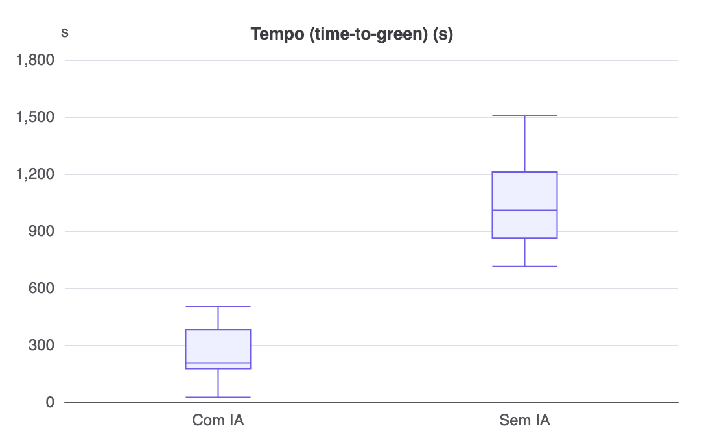
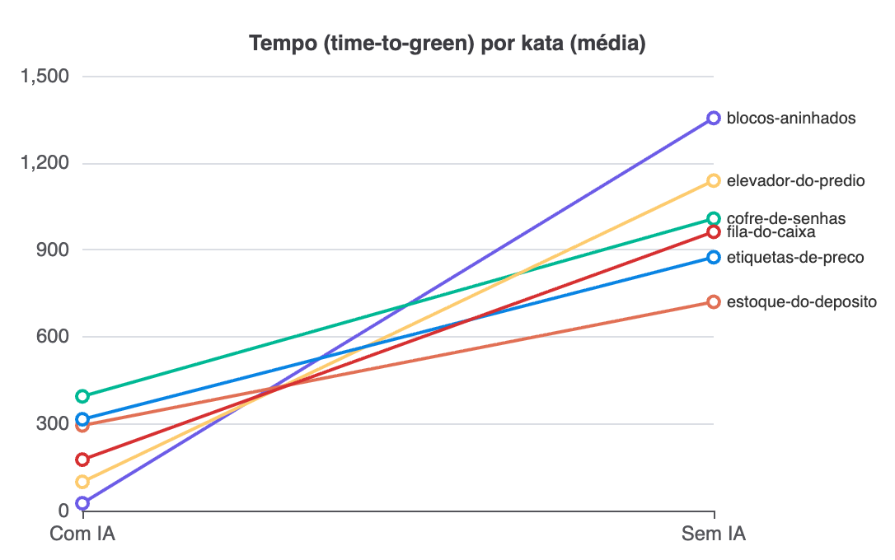

**Resultado**: mediana do tempo até passar em todos os testes de aceitação, 206,5s em `com_ia` (IQR 205,3s) contra 1007,0s em `sem_ia` (IQR 348,6s), cerca de 4,9 vezes mais rápido com IA, diferença estatisticamente significativa (Mann-Whitney p<0,001).

A caixa de `com_ia` fica inteira abaixo da caixa de `sem_ia`, sem nenhuma sobreposição, o padrão mais limpo de toda a seção. No gráfico por kata, as 6 linhas sobem da esquerda para a direita, sem exceção, `com_ia` mais rápido em cada um dos 6 katas.

**RQ2, o uso de assistente de IA reduz a quantidade de defeitos (testes que falham) no código produzido?**

**Resultado**: 100% de sucesso e 0 testes falhando em todos os 18 trials, `com_ia` e `sem_ia`, sem nenhuma diferença entre tratamentos.

Sem gráfico aqui, de propósito, um boxplot ou uma linha de valor constante não teria caixa nem inclinação para interpretar.

**RQ3, o uso de assistente de IA altera a complexidade ciclomática ou a duplicação do código produzido?**

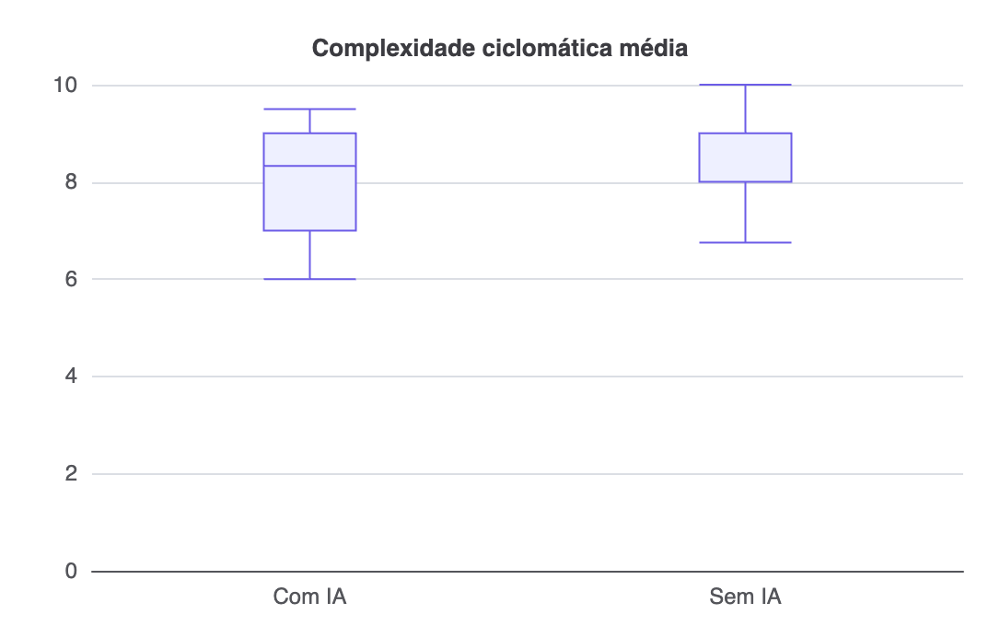
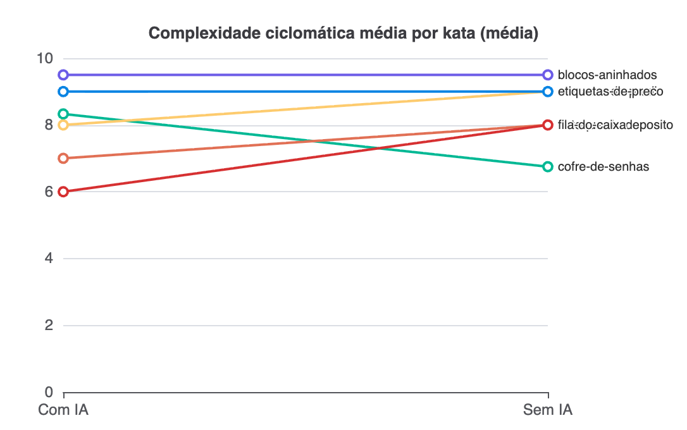

**Resultado**: mediana da complexidade ciclomática média por método, 8,33 em `com_ia` (IQR 2,0) contra 9,0 em `sem_ia` (IQR 1,0), diferença pequena e não significativa (Mann-Whitney p=0,377).

Quanto menor a complexidade, mais simples o código. As caixas de `com_ia` e `sem_ia` se sobrepõem bastante aqui, ao contrário do gráfico de tempo, coerente com uma diferença pequena.

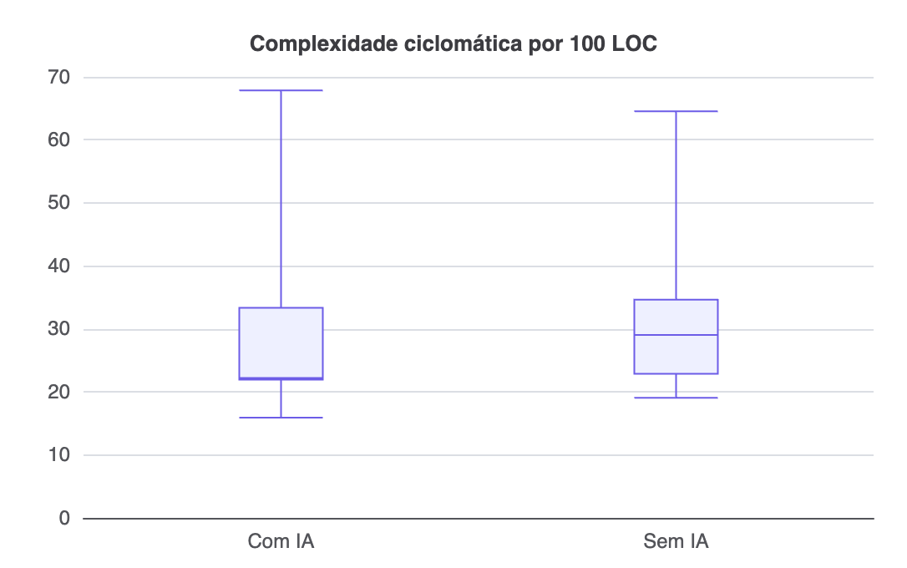
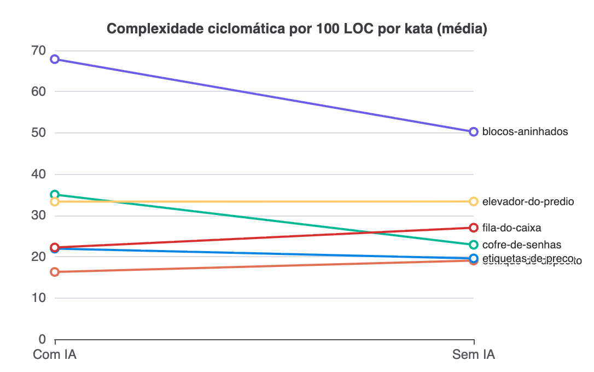

**Resultado**: mediana 22,22 por 100 LOC em `com_ia` (IQR 11,38) contra 29,03 em `sem_ia` (IQR 11,74), também pequena e não significativa (Mann-Whitney p=0,588). Duplicação, mediana 0% nos dois tratamentos, sem gráfico pelo mesmo motivo de RQ2.

Mesma complexidade do gráfico anterior, agora dividida pelo tamanho do código, por 100 linhas, em vez de pelo número de métodos. Repare no gráfico por kata, diferente do de tempo, as linhas não vão todas para o mesmo lado, 3 dos 6 katas descem (`com_ia` mais complexo por LOC, Blocos Aninhados, Cofre de Senhas, Etiquetas de Preço), 2 sobem (`com_ia` menos complexo, Estoque do Depósito, Fila do Caixa) e 1 fica praticamente empatado (Elevador do Prédio, diferença de 0,05), essa mistura de direção é a inconsistência discutida em 4.3.

**Inovações do grupo (verbosidade e estilo)**

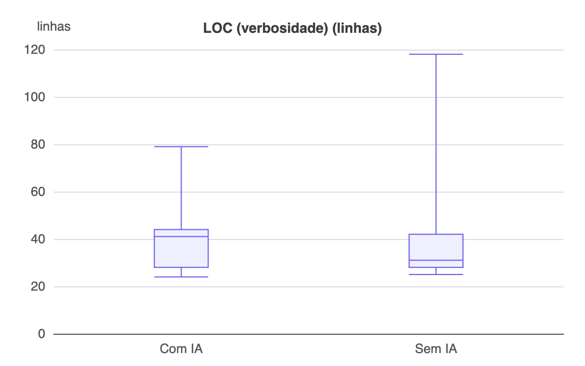
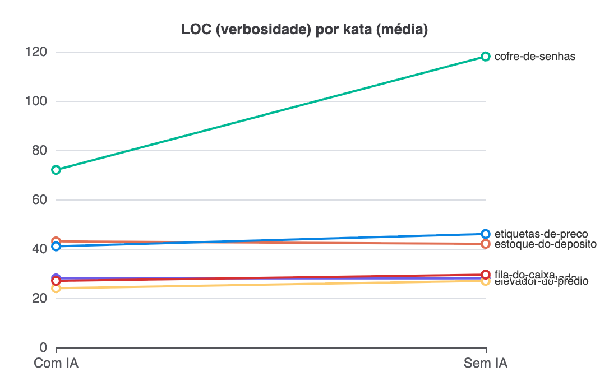

**Resultado**: mediana 41 linhas em `com_ia` (IQR 16,0) contra 31 em `sem_ia` (IQR 14,0), maior verbosidade com IA, mas sem significância no teste não pareado (Mann-Whitney p=0,624).

LOC é o controle de verbosidade da RQ3, não uma métrica de qualidade por si só. As duas caixas quase se sobrepõem por inteiro (o primeiro quartil é o mesmo nos dois tratamentos), a diferença aparece na mediana, deslocada para cima em `com_ia`.

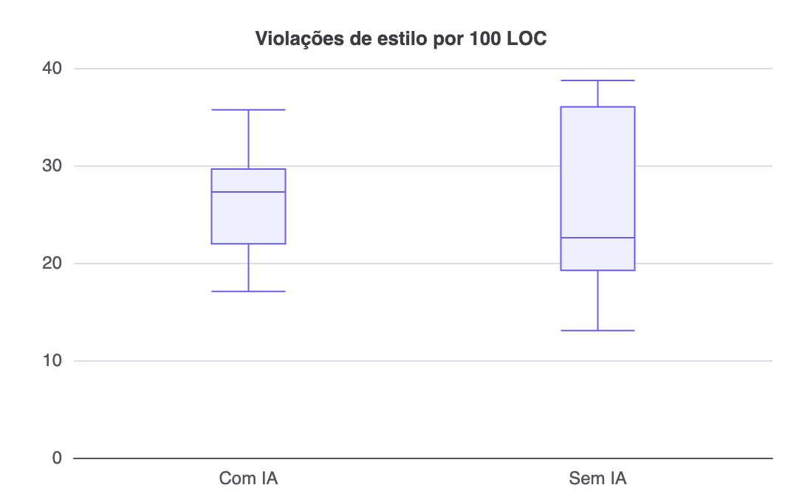
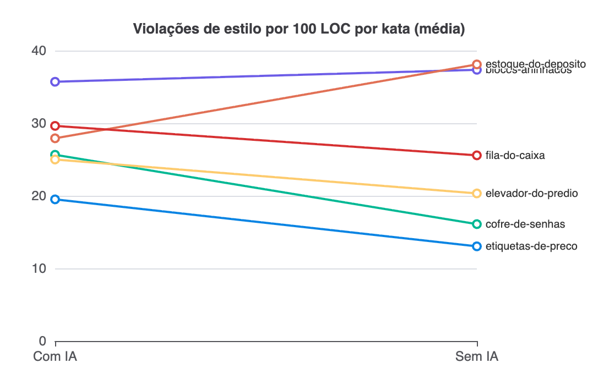

**Resultado**: mediana 27,27 violações por 100 LOC em `com_ia` (IQR 7,68) contra 22,58 em `sem_ia` (IQR 16,77), sem diferença estatística clara (Mann-Whitney p=0,950).

Violações de estilo (PMD `codestyle`) já divididas por 100 LOC, para não confundir "mais violações" com "mais código". Caixas bem próximas e sobrepostas, as linhas por kata também vão em direções diferentes entre si.

### 4.3 Discussão

**RQ1, tempo**: hipótese confirmada. A mediana de tempo caiu de 1007,0s (`sem_ia`) para 206,5s (`com_ia`), efeito máximo e significativo nas duas medidas, r rank-biserial de -1,0 no Wilcoxon pareado por kata (W+=0, n=6, p=0,031, o menor p alcançável com apenas 6 pares) e Cliff's delta de -1,0 no Mann-Whitney não pareado (9 vs 9, p<0,001, separação perfeita entre os dois grupos). Os 6 katas, sem exceção, tiveram `com_ia` mais rápido que `sem_ia`, a convergência das duas análises, pareada e não pareada, dá confiança de que o efeito é real e não um artefato de um único teste.

**RQ2, defeitos**: hipótese nem confirmada nem refutada, sem o que testar. Os 18 trials tiveram 100% de sucesso e 0 testes falhando, `com_ia` e `sem_ia`, sem nenhuma variância entre tratamentos. Isso não significa "sem efeito", significa que os katas foram calibrados dentro da capacidade dos dois tratamentos no time-box de 35 minutos, um resultado esperado do próprio desenho do experimento, não uma falha de coleta.

**RQ3, estrutura do código**: hipótese parcialmente confirmada, com uma inconsistência que vale registrar. A parte de duplicação bateu com o esperado, 0% nos dois tratamentos, sem diferença. A complexidade ciclomática bruta por método ficou menor em `com_ia` (mediana 8,33 vs 9,0, Wilcoxon pareado p=0,625 com r=-0,40 médio, Mann-Whitney p=0,377 com Cliff's delta -0,25 pequeno), mas com apenas n=4 pares não zerados (2 dos 6 katas tiveram diferença zero de `cc_media` entre tratamentos), é a estimativa menos confiável do conjunto. A versão normalizada por 100 LOC não confirma essa direção, os 18 trials agrupados só por tratamento dão `com_ia` menor (mediana 22,22 vs 29,03), mas pareando por kata a direção não é uniforme, `com_ia` fica mais complexo por LOC em 3 dos 6 katas, menos complexo em 2, e praticamente empatado em 1 (Wilcoxon p=0,688, r=0,24 pequeno, sinal oposto ao da métrica bruta). Nenhuma das estatísticas cruza 0,05, então nada disso é conclusivo, mas a inversão de sinal entre a comparação simples por tratamento e a comparação pareada por kata mostra que a mediana não pareada pode estar sendo puxada por qual kata caiu em qual tratamento (o contrabalanceamento troca o integrante, não o kata, entre tratamentos), não por um efeito real do assistente de IA. Com N=18 e 6 pares, RQ3 fica sem resposta clara, nem confirmando nem refutando a expectativa de pouca diferença de complexidade levantada na Introdução.

**Inovação, verbosidade e estilo (LOC e PMD `codestyle`)**: LOC ficou maior em `com_ia` (mediana 41 vs 31 linhas), confirmando a expectativa de maior verbosidade levantada na Introdução, com efeito grande no teste pareado (r=-0,87, p=0,125) mas não significativo no não pareado (p=0,624), o mesmo padrão de RQ1, um efeito visível que ainda não cruza 0,05 com N=18. Violações de estilo por 100 LOC ficaram um pouco maiores em `com_ia` (mediana 27,27 contra 22,58 de `sem_ia`), mas sem diferença estatística clara, o teste pareado deu efeito médio não significativo (p=0,563) e o não pareado deu efeito negligível (p=0,950). Ou seja, o código com IA saiu mais verboso, mas não claramente menos conforme ao style guide por linha.

**Inovação, correlação tempo x violações**: a hipótese de que "pressa gera mais violações" não se sustentou de forma consistente, a correlação de Spearman deu sinais opostos entre os tratamentos e nenhuma passou no limiar de 0,05 bilateral (a mais próxima, `com_ia`, tempo x violações por KLOC, rho=-0,57, p=0,121), então não há evidência forte de que o tempo do trial, por si só, explique a diferença de conformidade de estilo.

**Inovação, segurança (Semgrep)**: 0 vulnerabilidades encontradas nos 18 trials, `com_ia` e `sem_ia`, resultado esperado dado o escopo pequeno e a natureza dos katas, que não envolvem entrada de rede, banco de dados ou serialização, superfícies mais comuns de vulnerabilidade estática.

**Síntese das inovações**: as seis frentes adicionais (seção 1) não contradisseram os 70% do enunciado, aprofundaram, dando tamanho de efeito onde só havia p-valor, mostrando que a maior verbosidade de `com_ia` é real mas não necessariamente pior em conformidade de estilo, e descartando a hipótese simples de que pressa explica a diferença de estilo observada.

## 5. Conclusão

*ORIENTAÇÃO: Sintetize, em poucos parágrafos, as respostas a todas as RQs (enunciado + inovação do grupo), sem repetir números já discutidos em detalhe — o objetivo aqui é a mensagem final, não os dados brutos. Aponte as principais limitações do estudo (tamanho de amostra, ameaças à validade não mitigadas, período de coleta). Quando o enunciado pedir explicitamente uma postura de consultoria (caso do Lab05, que pede recomendações de melhoria de processo "como se o grupo fosse consultoria para um time real"), inclua recomendações objetivas e acionáveis, não genéricas. Encerre indicando o que o grupo faria diferente com mais tempo ou recursos, e quais das inovações propostas (30%) valeriam a pena expandir em um trabalho futuro.*

*[conteúdo do grupo — substituir este texto]*

## 6. Referências

- ZUSE, Horst. A framework of software measurement. Walter de Gruyter, 2013.
- BASILI, V. R.; CALDIERA, G.; ROMBACH, H. D. The Goal Question Metric Approach. In: Encyclopedia of Software Engineering. Wiley, 1994.
- MCCABE, T. J. A Complexity Measure. IEEE Transactions on Software Engineering, v. SE-2, n. 4, p. 308-320, 1976.
- 